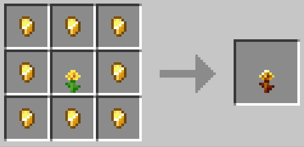

将金蒲公英带到了1.21

[**金蒲公英**](https://minecraft.wiki/w/Golden_Dandelion)是 [26.1-snapshot-5](https://minecraft.wiki/w/Java_Edition_26.1_Snapshot_5) 更新加入游戏中的物品

对一些生物使用**金蒲公英**，可以将生物锁定为**幼年**状态，再次右键将使其重新生长

注意：这个金蒲公英不能放置！

配方

---

Brought Golden Dandelion to 1.21

The [**Golden Dandelion**](https://minecraft.wiki/w/Golden_Dandelion) is an item added in the [26.1-snapshot-5](https://minecraft.wiki/w/Java_Edition_26.1_Snapshot_5) update.

Using **Golden Dandelion** on some creatures can lock them in **baby** state, right-clicking again will make them grow back.

Note: This golden dandelion cannot be placed!

Recipe
